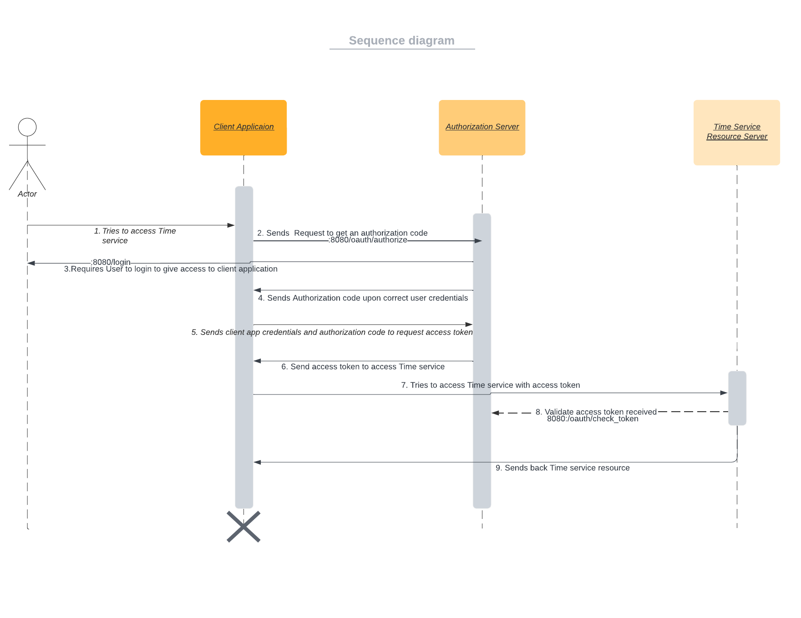

# OAuthExample

A minimal micro service to illustrate the OAuth2 protocol iwth spring boot.

 > Note: This repository is currently under development / refactoring and not in a stable state. I cannot make it private since it is a fork.

## About

The OAuth2 protocol is an industrial standard to allow access of REST resources thorugh a third party service, on behalf of their owner. The purpose is to strip the need for credential sharing, by means of impersonation via cryptographic tokens.
The key entities in any OAuth2 interplay are:

 * A *Resource Server*: It offers a resource, belonging by a *Resource Owner*. The latter is usually a biological or legal person.
 * A *Proxy Service*: It needs to access a protected resource of the *Resource Server*, on behalf of the *Resource Owner*.
 * A *Token Service*: It is the center part of the OAuth2 protocol and provides secure tokens that allow impersonation of the *Resource Owner* by the *Proxy Service*, without credential sharing.

This repository hosts sample implementations of the three services, that allow a play-though of the protocol.

## Services

This repository reflects the [standard protocol entities](#about) as follows:

 * A [modified version](TimeService) of the TimeService as resource server: Sample users (resource owners) have their proper time resource, which upon access tells the time in their customized format.
 * A newly coded [Time Proxy Service](TimeProxy) which attempts to access the TimeService on behalf of the user and therefore needs to be delegated permission, using the OAuth2 Protocol.
 * A standard [Authorization Service](AuthorizationService) which keeps track of users, services, granted access and tokens, to allow for an execution of the OAuth2 protocol. 

## Communication Layout

## Further links

 * Initial version of the [Legacy Time Service](https://github.com/m5c/TimeServiceLegacy)
 * Initial version of the [Secured RESTful Time Service](https://github.com/m5c/OAuth2SpringBootDemo)
 * Initial version of the [Authorized RESTful Time Service](https://github.com/m5c/TimeServiceOAuth2Modular), where proxy and resource server are still fused.
 * OAuth2 [Protocol Specification](https://datatracker.ietf.org/doc/html/rfc6749#section-4.1)
 * Spring Boot [OAuth2 Sample Tutorial Page](https://howtodoinjava.com/spring-boot2/oauth2-auth-server/)

## Authors

 * Implementation Draft: [Khabiir](https://github.com/khabiirk), ([Original Repo](https://github.com/khabiirk/OAuthExample))
 * Documentation and Refactoring: [Maximilian](https://www.cs.mcgill.ca/~mschie3/), (This Repo)