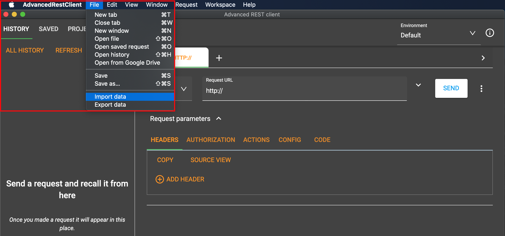
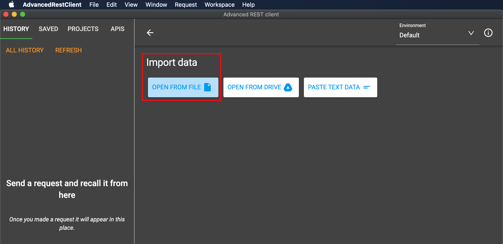
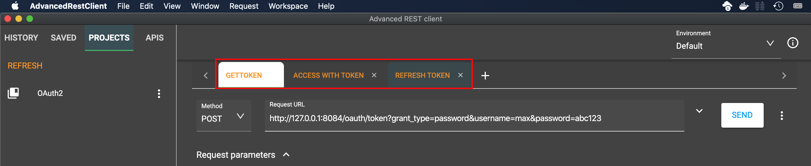
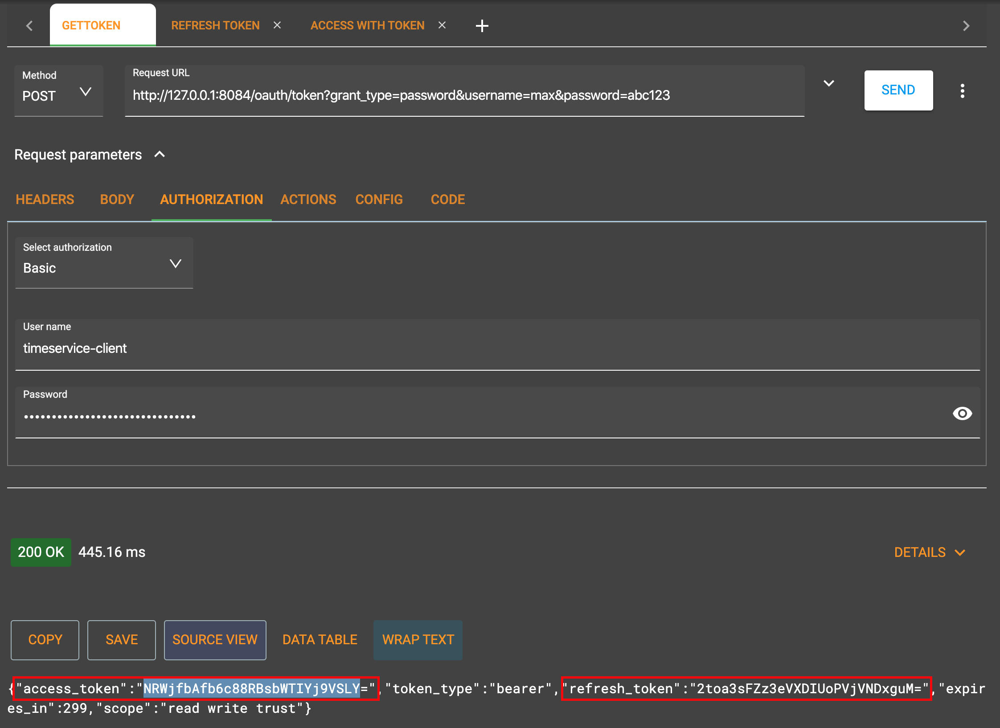
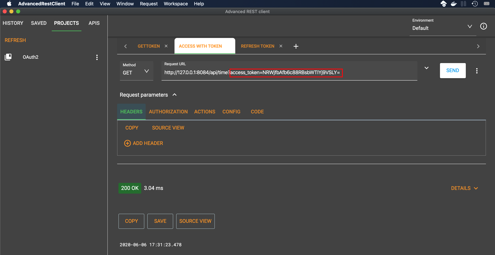
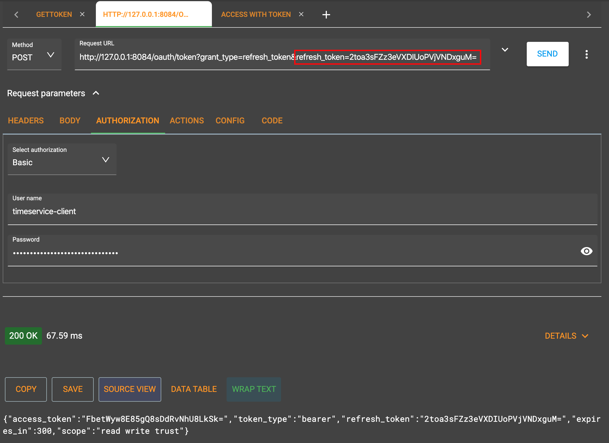

# Advanced REST Client Setup

## About

This little extra document shows you how to get the prepared queries running, with minimal effort.  
This repo contains a config file for the Advances REST Client (ARC), that allows you to test your deployed service with the click of mouse.

*Note:* You still have to slightly modify some of the imported queries, for the token strings are dynamic content.

## Installation

The Advanced REST client can be installed as browser plugin or natively.  
You can [get it directly from the developers](https://install.advancedrestclient.com/install).

## Import prepared queries

 * Download [this file](oauth2.arc) and save it somewhere on disk.
 * Open the ARC.
 * Select ```File -> Import Data```



 * Select ```Open from file```



 * Select the ```oauth2.arc``` file you downloaded in the first step.

 * After the import, switch to the ```Projects``` tab, then click the ```...``` menu, select ```Open all in workspace```.


 * You should now see three tabs, each of which represents a prepared query.
   * *Get Token*
   * *Access with Token*
   * *Refresh Token*



## Test your service

Hit the ```Send``` buttons for the individual requests in the same order as explained in the [main instructions](../README.md#access).

Don't forget that you have to alter the URL parameters of *Access with Token* and *Refresh Token* with the token strings in the response from your *Get Token query*:

 * Here are the tokens in your original *Get Token* query:



 * Here you have to insert your session token:



 * Here you have to insert your renewal token:



